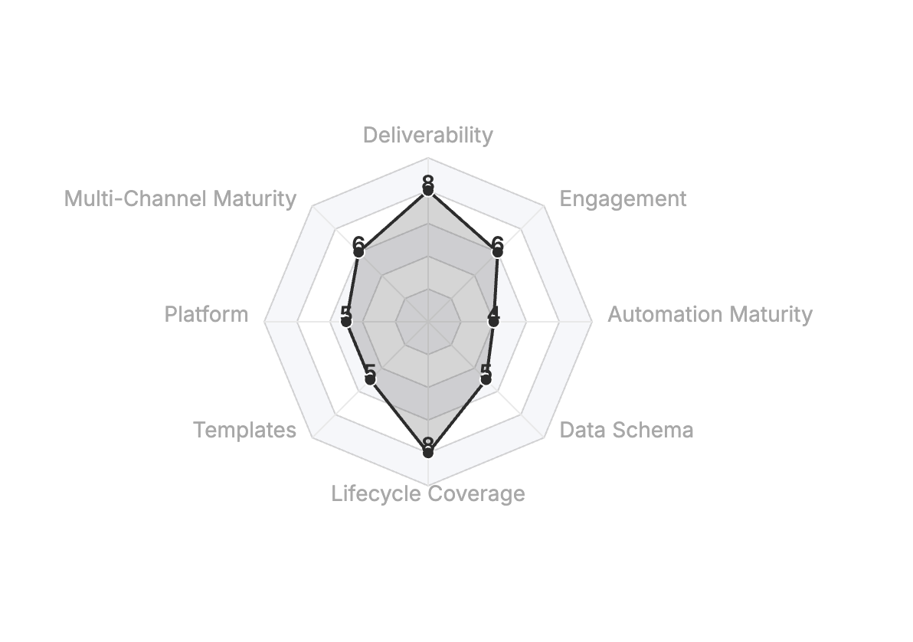
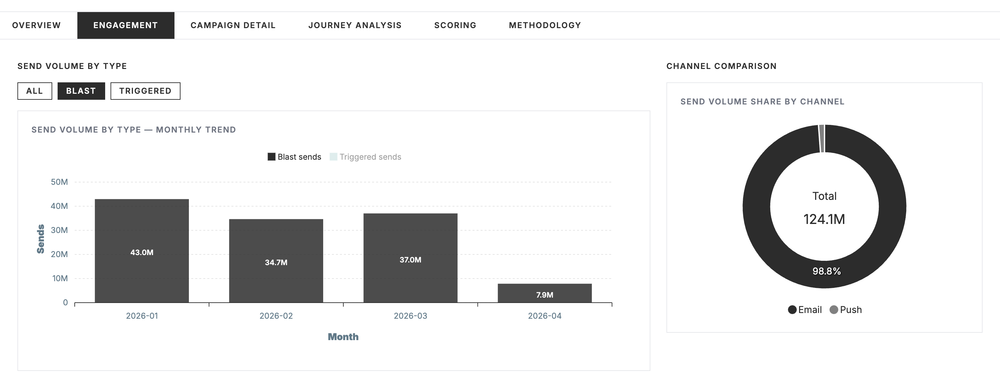
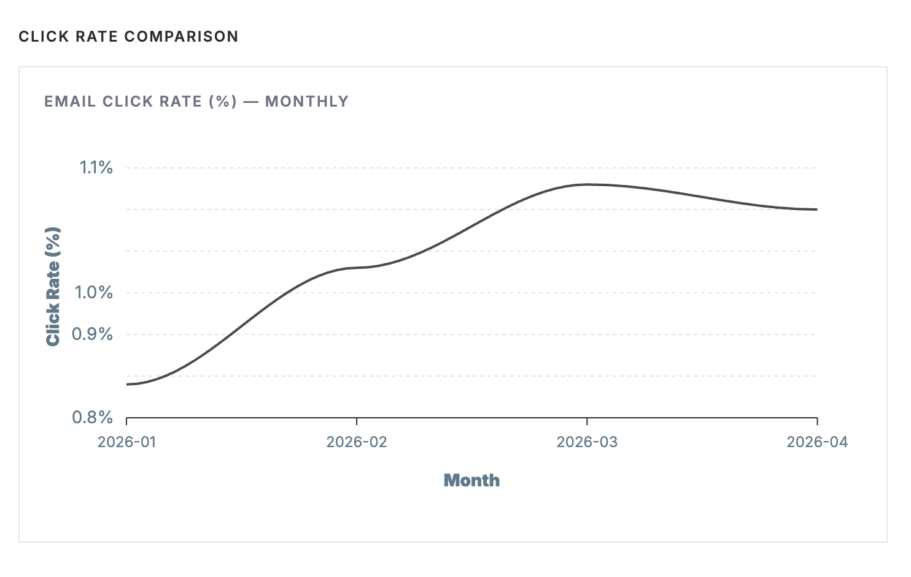

# PALM — Iterable Metrics & Dashboard Toolkit

PALM (Personified Agent-assisted Lifecycle Marketing) helps Iterable teams understand their campaign performance. It pulls your data, builds an interactive dashboard with health scores and charts, and packages it all into a single file you can share with anyone.

Built by [Modular Marketing](https://modularmarketing.com) -- lifecycle marketing specialists.

---

## What PALM Does

- Pulls your workflows, campaigns, and engagement data from Iterable
- Builds an interactive dashboard with health scores, data quality flags, and charts across six tabs
- Packages everything into a single HTML file that works offline -- no server, no internet needed
- Branded and ready to share in meetings, over email, or in Dropbox

### Dashboard Preview

**Health Radar** -- see your lifecycle program health at a glance across 8 dimensions:



**Engagement Analytics** -- send volume trends, channel mix, and campaign type breakdowns:



**Performance Trends** -- track click rates, open rates, and other engagement metrics over time:



---

## Getting Started

PALM runs inside [Claude Code](https://code.claude.com/docs/en/), Anthropic's AI coding tool. Claude Code is a terminal-based tool -- you'll open your terminal once to install PALM, then you won't need the terminal again.

### Step 1: Install Claude Code

If you don't have it yet, follow the [Claude Code install guide](https://code.claude.com/docs/en/).

### Step 2: Open your terminal

- **Mac:** Open the Terminal app (search "Terminal" in Spotlight)
- **Windows:** Open Command Prompt or PowerShell

### Step 3: Paste the install command

Open Claude Code by typing `claude`, then paste this prompt:

```
Clone https://github.com/modularmarketing/palm-public.git to ~/palm-public, run npm install, and copy the three skill folders from ~/palm-public/.claude/skills/ into ~/.claude/skills/.
```

This downloads PALM and installs three skills globally. Claude Code will ask for permission to run some terminal commands -- just approve them. You only do this once.

### Step 4: Restart Claude Code

Close and reopen Claude Code. The PALM skills load on startup and persist across all your sessions.

### Step 5: Use PALM

Type `/palm:get-metrics` to pull your Iterable data, then `/palm:dashboard` to build your dashboard.

See [SETUP-CLAUDE-CODE.md](docs/SETUP-CLAUDE-CODE.md) for a detailed walkthrough.

---

## Talking to PALM

Just talk to Claude naturally -- it knows how to use the PALM tools.

**Pull your metrics:**
> "Pull my Iterable metrics for Acme Corp."

**Generate a dashboard:**
> "Build me a dashboard from the Acme Corp data."

**Learn what PALM does:**
> "What can PALM do?"

**Troubleshooting:**
> "I'm getting an error about a missing API key. How do I set that up?"

---

## Requirements

- **Claude Code** -- [install guide](https://code.claude.com/docs/en/) (includes Node.js, which PALM needs)
- **Iterable API key** -- log in to Iterable, go to Settings > API Keys, and copy your key. A read-only key works fine.

---

## How It Works

1. **Metrics extraction** -- PALM connects to the Iterable API and pulls your workflows, campaigns, and engagement metrics. Everything is saved locally.
2. **Dashboard generation** -- PALM reads your data, calculates health scores, and generates a single HTML file with interactive charts and professional typography.
3. **Fully offline** -- the dashboard works without an internet connection. All charts, fonts, and brand assets are embedded in the file. Open it in any browser from Finder or File Explorer.

---

## Advanced: Claude Desktop (Binary)

If you prefer Claude Desktop over Claude Code, PALM is also available as a pre-compiled binary. This path is more technical -- it involves downloading a binary, editing a JSON config file, and setting environment variables.

Download the binary for your platform from [Releases](https://github.com/modularmarketing/palm-public/releases/latest):

| Platform | File |
|----------|------|
| macOS Apple Silicon (M1/M2/M3/M4) | `palm-mcp-darwin-arm64` |
| macOS Intel | `palm-mcp-darwin-x64` |
| Windows | `palm-mcp-windows-x64.exe` |

See [SETUP-CLAUDE-DESKTOP.md](docs/SETUP-CLAUDE-DESKTOP.md) for full instructions.

---

## Contributing

Issues and pull requests welcome. Please open an issue before starting large changes.

Apache License 2.0 -- see [LICENSE](LICENSE) and [NOTICE](NOTICE).

Created and developed by Jon Uland (@jonstermash) at [Modular Marketing](https://modularmarketing.com). For a full Lifecycle Health Check, [contact us](https://modularmarketing.com).
